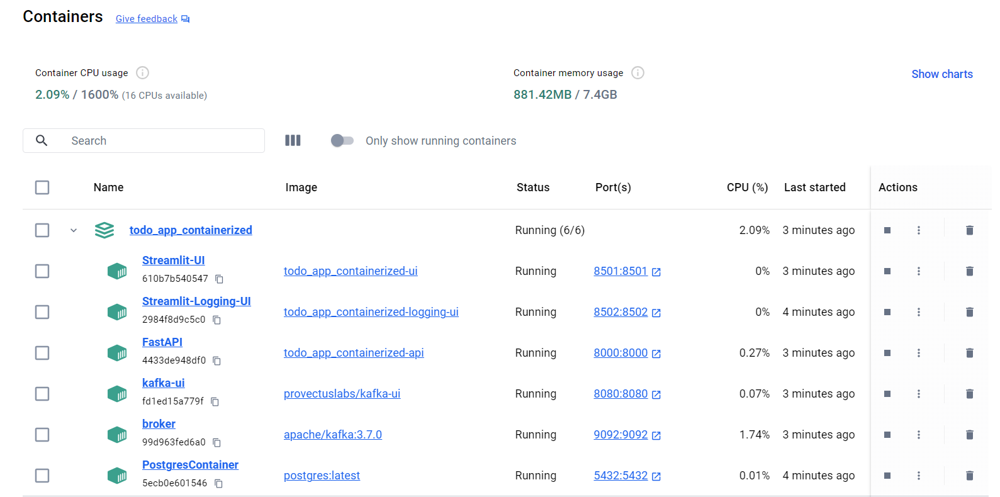
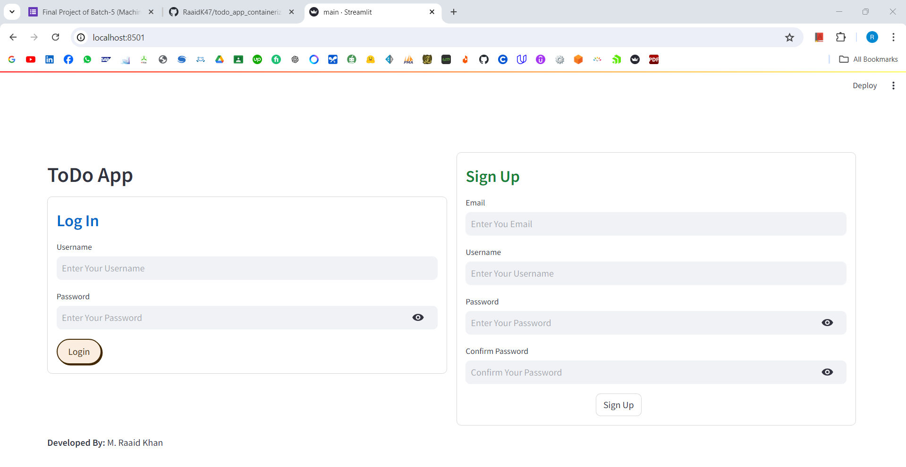
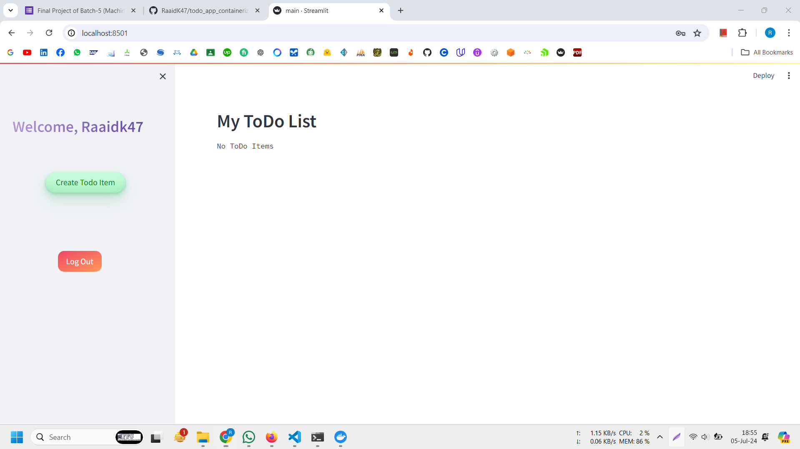
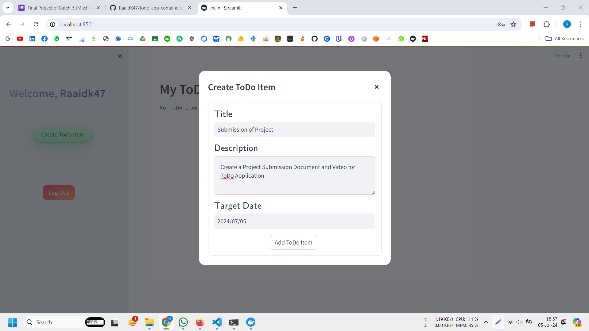
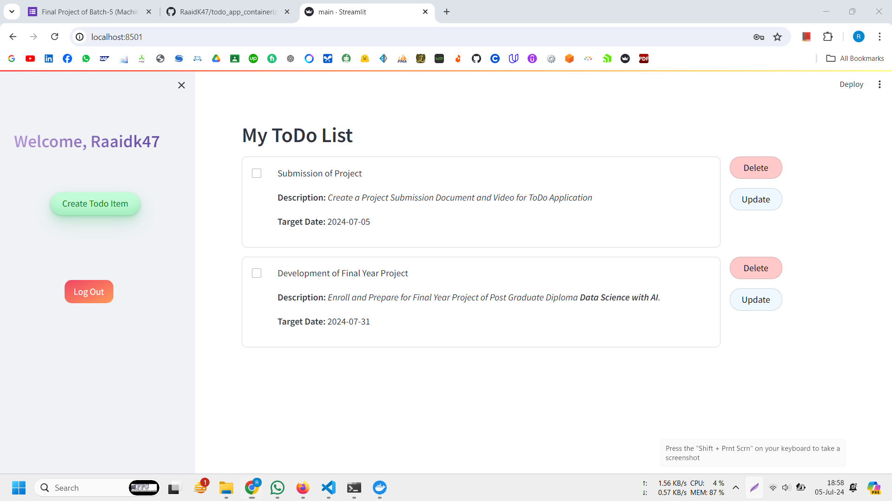
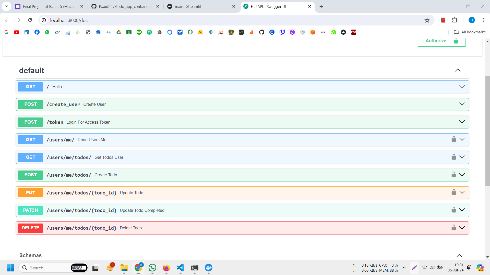
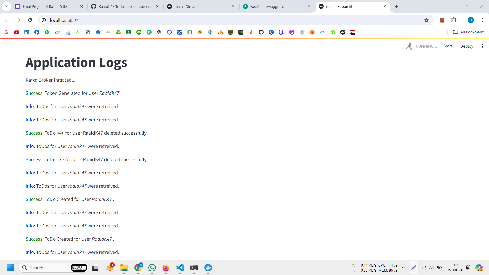
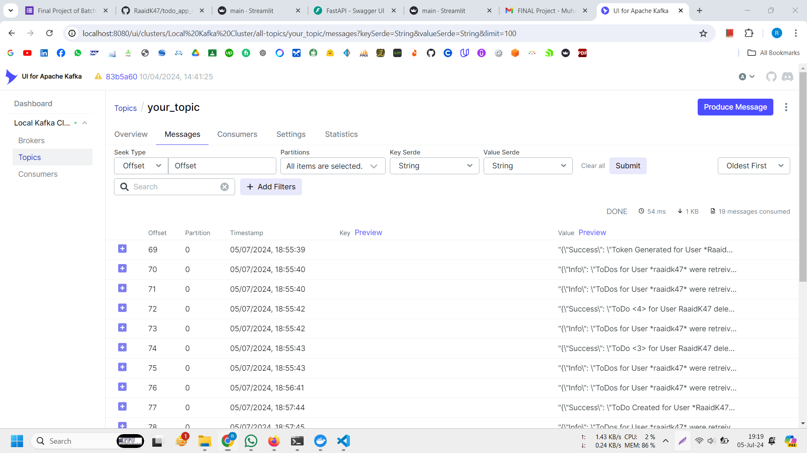

# ToDo App Project

## Submitted By:

* Muhammad Raaid Khan
* CNIC: 42301-59351973-3
* Cell: 0303-9123287
* Data Science With AI (Batch-05)
* NED Academy (CCEE)

## Technologies Used

* Poetry
* Docker 
* Docker-Compose
* Streamlit
* FastAPI
* Postgres Database
* Kafka
* Kafka-UI
* Amazon Web Services (AWS)

## Running App

* Download Code to local machine
* Start Docker Desktop
* Open CMD/Terminal in Project Directory
* Run command `docker compose up --build` to start services
* Docker will fetch all dependencies from Docker Hub
* After successful start, containers will be as below in Docker Desktop

## Accessing User Interface

* Go to `http://localhost:8501` to Access UI.

    

* Create a New User or Log-In with Existing User.
  * All controls for Username and Email checks are implemented in the Application.

* After logging in, below Interface will be visible

    

* You can create new ToDo Items using the Button.

    
    

* You can **Update** or **Delete** ToDos using the respective buttons.

## FastAPI Backend

* Go to `http://localhost:8000/docs` to access Swagger Documentation of FastAPI.
* 
    

*  Authentication in FastAPI is achieved using JSON Web Tokens (JWTs)
  
## Database

* Postgres Database is implemented as a separate Docker Container.
* Connectivity to Database is implemented using Environment Variables.

## Kafka - UI

* Kafka is implemented to log all activities of all users on a single platform.
* **Producer** of Kafka Events is the Backend of Application (FastAPI)
* **Consumer** of Kafka Events is a Streamlit Window that Logs all the activities.
* Go to `http://localhost/8502` to access Logging Page.
* 
    

* This page will log history of all users even if they are using the application simultaneously.

* You can also go to `http://localhost:8080` to access Kafka-UI as below

    

## Deployment on AWS.

* Application is deployed on AWS Cloud Servers.
  
  * Kafka functionality is not available in AWS Version of application as it is not supported in Free-Tier version of AWS account.

* Application and Documentation can be accessed via below links

    **App (AWS):** https://lnkd.in/dw_WZ8yz

    **App Documentations:** https://tinyurl.com/todo-app-raaid-docs

## Video

* Video of LinkedIn Post can be accessed from below link

    **Video (LinkedIn):** https://www.linkedin.com/posts/raaid-khan_fastapi-docker-postgres-activity-7201649032367190016-f_6t?utm_source=share&utm_medium=member_desktop